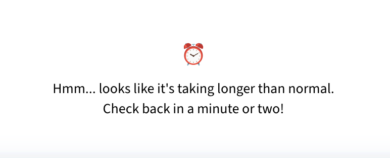

# Physician Notetaker [Emitrr Assign]
---
# Introduction
This assignment is done by answering the follwing alloted question : [click](https://sunset-parrot-38b.notion.site/Physician-Notetaker-1ac7fca3d41680849078deb25228b34f)

This project converts the conversaton between Doctor and patient in specified json format , Analyse the patient's Sentiment, SOAP Note, Summary and Keywords extracted form the ocnversation to interprete subject of the conversation more accurately.

The models and ideas I have used/implemented here are:
1. <b>Name Entity Recognition [NER]</b> <i>(Fast pattern matching)</i>
2. <b>BioBERT</b> <i>(Specialized for biomedical text and medical terms)</i>
3. <b>BERT CONLL03 (LLM)</b> <i>(Complex info handling model for names)</i>
4. <b>Fine Tuned BioBERT</b> <i>(Custom-trained model for medical entity extraction)</i>


> Only Three Section of README: 
> - App Usage : First Section of this readme is walkthrough of how to use deployed app.
>- Running Locally : Second Section will explain how to run this repo on local machines.
> - Questions Discussed :


<details>
<summary>Project's Mind</summary>

```
Physician Notetaker [Assignment]
├── 1. assets
│   ├── Images
│   │   └── imageewcwec 
│   ├── Text Summarization
│   │   └── ..
│   └── Keyword Extraction
│       └── ..
│
├── 2. models
│   ├── fine_tunedbert
│	│	├── logs
|	|	|    └── eventpath
|	|	├── checkpoints_30th (time_capsule)
|	|	|	├── model.safetensors
|	|	|	├── model.safetensors
|	|	|	├── special_token_map.json
|	|	|	├── tokenizer_config.json
|	|	|	├── tokenizer.json
|	|	|	├── training_args.bin
|	|	|	├── vocab.txt
│   │   |	└── config.json
|	|	|   └── eventpath
|	|	├── model.safetensors
|	|	├── special_token_map.json
|	|	├── tokenizer_config.json
|	|	├── tokenizer.json
|	|	├── training_args.bin
|	|	├── vocab.txt
│   │   └── config.json
│   └── fine_tunedbert 2nd attemt
│       └── ...[lazyyyy]
│
├── 3. results
│   └── checkpoints ...
|
├── 4. utils
│   ├── __init__.py
│   ├── bert_name_detectir.py
│   ├── biobert_finetuned.py
│   ├── biobert_ner.py
│   ├── keyword.py
│   ├── model_cache.py
│   ├── name_detector.py
│   ├── ner.py
│   ├── sentiment_analysis.py
│   ├── soad_generator.py
│   ├── summarization.py
│   └── train_biobert_finetuned.py
│
├── requirements.py
├── restore.py
├── test.py
├── transcrips.py
├── app_benching.py
└── app.py
```
</details>

---

# App Usage

The following images provide a step-by-step guide on how to use the app:


1. Home Screen: Left portion is controls and right is Resutl Display Area.
   

2. Sampe Conversation: Can test using smaple converstations
   

3. Model Selection: Provided 3 models and 1 Rule Based Approach(NER)
   

> **Still Loading???** : Don't panic if white screen or loader arrives. it will take a while to run all processes and model's health.
   


### Video link of App Usage : [click](https://youtu.be/w60QKjQIUjE)

---
# Running Locally

- Clone the Repository
	```bash
	git clone https://github.com/vishesh9131/emitrr_assign.git
	```
- If in VSCode or similar IDE type the following in the terminal after navigating to the repo folder:
	```powershell
	pip install -r requirements.txt
	```
- [SKIP if already done point 2] If you're just in a terminal or cmd-prompt or powershell :
	#### Windows PowerShell
	```powershell
	cd "Downloads\physician-notetaker"
	pip install -r requirements.txt
	```
	#### macOS/Linux Terminal
	```sh
	cd path/to/physician-notetaker
	pip install -r requirements.txt
	```
- Then simply run in prompt/terminal/powershell:
	```sh
	streamlit run app.py
	```
> Initially it will take a while to download all the models.

> **Tip**: If you want to create a virtual environment first (recommended):
>
> **Windows**:
> ```
> python -m venv venv
> venv\Scripts\activate
> pip install -r requirements.txt
> ```
>
> **macOS/Linux**:
> ```bash
> python3 -m venv venv
> source venv/bin/activate
> pip3 install -r requirements.txt
> ```

---
# Questions Discussed

### 1. How does the system handle ambiguous or missing medical data in transcripts?
The system employs several strategies to handle ambiguous or missing medical data:
 
**For NER rule based approach**

- **Default Values**: When specific entities aren't found, the system provides standardized default values (e.g., "Unknown symptoms", "Unknown diagnosis").
  ```python
  if not symptoms:
      symptoms = ["Unknown symptoms"]
  result["Symptoms"] = symptoms
  ```

- **Context-Based Inference**: The system attempts to infer information based on context clues in the transcript.
  ```python
  if "heart palpitations" in text.lower() or "palpitations" in text.lower():
      result["Diagnosis"] = "Possible arrhythmia"
  else:
      result["Diagnosis"] = "Unknown diagnosis"
  ```

- **Pattern Matching Redundancy**: Multiple patterns are used to detect the same entity types, increasing the chance of capturing information even when expressed in different ways.
  ```python
  self.entity_patterns = {
      "Symptoms": [
          r"(stomach pain|abdominal pain|cramping pain|bloating|constipation)",
          r"(neck pain|back pain|head impact)",
          # Multiple additional patterns...
      ],
  }
  ```

- **Entity Validation**: Extracted entities undergo validation to filter out false positives, reducing the chance of incorrect information being included in the final output.
  ```python
  def _is_valid_name(self, name):
      # Extensive validation logic to ensure extracted names are legitimate
      # and not medical terms or other non-name text
  ```


**For Pretrained Models**
- In BioBERT I combined transformer-based learning with domain-specific pattern matching for medical entities.

- **Contextual Inference**: When explicit information is missing, BioBERT attempts to infer diagnoses from context.

**For FineTuned BioBERT Models** : refer to ```extract_entities()```

**For CONLL03 Model**

- **Fallback Mechanisms**: The model incorporates BERT-CONLL03 as a fallback for name extraction when BioBERT's medical focus might miss person names.
  ```python
  # Fallback to BERT-CONLL03 for entity extraction
  self.bert_model_name = "dbmdz/bert-large-cased-finetuned-conll03-english"
  self.bert_tokenizer = AutoTokenizer.from_pretrained(self.bert_model_name)
  self.bert_model = AutoModelForTokenClassification.from_pretrained(self.bert_model_name)
  ```

### What pre-trained NLP models would you use for medical summarization?

For medical summarization, BioBERT would be the optimal choice due to its specialized training on biomedical literature.
Implementation would involve adding a summarization head to the BioBERT model and training it on paired examples of medical conversations and their summaries, potentially using a dataset of annotated doctor-patient interactions or SOAP notes.

### How would you fine-tune BERT for medical sentiment detection?

To fine-tune BERT for medical sentiment detection, I would implement the following approach:

1. **Model Selection**: Start with BioBERT as the base model since it's already pre-trained on biomedical literature, giving it domain-specific knowledge.

2. **Architecture Modification**: Replace the token classification head with a sequence classification head for sentiment analysis:

	[i have taken refrence from reddit]

	<details>	
	<summary>AutoModelForSequenceClassification</summary>

   ```python
   from transformers import AutoModelForSequenceClassification
   model_name = "dmis-lab/biobert-base-cased-v1.1"
   tokenizer = AutoTokenizer.from_pretrained(model_name)
   model = AutoModelForSequenceClassification.from_pretrained(
       model_name, 
       num_labels=3  # For negative, neutral, positive sentiment
   )
   ```
	</details>
   


3. **Dataset Preparation**: Create a custom dataset class similar to the existing MedicalNERDataset but adapted for sentiment:
   <details>
   <summary>MedicalSentimentDataset Class</summary>

   ```python
   class MedicalSentimentDataset(torch.utils.data.Dataset):
       def __init__(self, texts, labels, tokenizer, max_length=512):
           self.texts = texts
           self.labels = labels
           self.tokenizer = tokenizer
           self.max_length = max_length
       
       def __len__(self):
           return len(self.texts)
       
       def __getitem__(self, idx):
           text = self.texts[idx]
           label = self.labels[idx]
           
           encoding = self.tokenizer(
               text,
               truncation=True,
               padding='max_length',
               max_length=self.max_length,
               return_tensors='pt'
           )
           
           return {
               'input_ids': encoding['input_ids'].flatten(),
               'attention_mask': encoding['attention_mask'].flatten(),
               'labels': torch.tensor(label, dtype=torch.long)
           }
   ```
   </details>

4. **Training Strategy**: Implement a training loop with medical domain-specific considerations:
   - Use a weighted loss function if the sentiment classes are imbalanced (common in medical data)
   - Apply a lower learning rate (2e-5 to 5e-5) for fine-tuning to preserve domain knowledge
   - Use larger batch sizes (16-32) for stable training
   - Monitor for overfitting with healthcare-specific validation sets

5. **Medical Context Integration**: Add special tokens or prompts to help the model understand the medical context:

	<details>

   ```python
   # Add special tokens for medical sentiment analysis
   special_tokens = {
       'additional_special_tokens': [
           '[PATIENT]', '[DOCTOR]', '[SYMPTOM]', '[TREATMENT]'
       ]
   }
   tokenizer.add_special_tokens(special_tokens)
   model.resize_token_embeddings(len(tokenizer))
   ```
	/details>

### What datasets would you use for training a healthcare-specific sentiment model?

For training a healthcare-specific sentiment model(bioBERT), I would use the following datasets:

[Researched from google took help from perplexity]

1. **MIMIC-III Clinical Notes**: Though primarily used for clinical information extraction, portions containing subjective assessments can be annotated for sentiment.

2. **Medical Transcription Samples**: Conversational data between healthcare providers and patients, which would need annotation for sentiment.

3. **Online Health Community Data**:
   - Patient forums like PatientsLikeMe or MedHelp
   - Reddit medical communities (r/AskDocs, r/medicine)
   - Healthcare-specific Twitter datasets

4. **Patient Satisfaction Surveys**: Hospital and clinic survey responses that include free-text comments.

5. **Drug Review Datasets**:
   - UCSF Drug Reviews corpus
   - UCI ML Drug Review Dataset (contains patient reviews and ratings)

6. **COVID-19 Sentiment Datasets**:
   - Several datasets containing tweets and social media posts about COVID-19, annotated for sentiment

(umm synthetic data augmentation like i have done in transcript.py)

### How would you train an NLP model to map medical transcripts into SOAP format?

I would implement a multi-stage approach to train an NLP model for SOAP note generation, building upon the existing `SOAPNoteGenerator` class:

1. **Architecture Selection**: Enhance the current extractive approach with a sequence-to-sequence model based on BioBERT:

   ```python
   # Enhancement to the current SOAPNoteGenerator initialization in utils/soap_generator.py
   class SOAPNoteGenerator:
       def __init__(self):
           # Current implementation is rule-based
           print("SOAP Note Generator initialized successfully")
           
           # Add BioBERT encoder with specialized medical knowledge
           self.encoder = AutoModel.from_pretrained("dmis-lab/biobert-base-cased-v1.1")
           # Add a decoder component for text generation
           self.decoder = TransformerDecoder(
               hidden_size=768,
               num_layers=6,
               num_attention_heads=12,
               intermediate_size=3072
           )
           # Connect encoder and decoder
           self.model = EncoderDecoderModel(encoder=self.encoder, decoder=self.decoder)
   ```

2. **Section Identification Training**: Building on the current section extraction methods like `_extract_subjective()`:

   ```python
   # Enhancement to current extraction methods in utils/soap_generator.py
   def train_section_classifier(self, training_data):
       """Train the model to classify text segments into SOAP sections"""
       # Current implementation uses rule-based extraction:
       # self._extract_subjective(dialogue)
       # self._extract_objective(dialogue)
       
       # Enhanced approach with supervised learning
       tokens = self.tokenizer(text, return_tensors="pt").input_ids
       
       # Label each token with its corresponding section (S/O/A/P)
       labels = ["O"] * len(tokens)  # Outside any section
       for section, section_spans in annotated_sections.items():
           for start, end in section_spans:
               labels[start] = f"B-{section}"  # Beginning of section
               for i in range(start+1, end):
                   labels[i] = f"I-{section}"  # Inside section
   ```

3. **Section Content Generation**: Improve the existing content generation methods like `_extract_key_phrase`:

   ```python
   # Enhancement to current utils/soap_generator.py helpers
   def generate_section_content(self, section_type, relevant_text):
       """Generate detailed content for a specific SOAP section"""
       # Current implementation uses simple extraction:
       # self._extract_key_phrase(text)
       # self._simple_summarize(text)
       
       # Enhanced generative approach
       prompt = f"Generate a detailed {section_type} section based on: {relevant_text}"
       
       # Generate appropriate content for the section
       inputs = self.tokenizer(prompt, return_tensors="pt")
       outputs = self.model.generate(
           inputs.input_ids,
           max_length=150,
           num_beams=4,
           no_repeat_ngram_size=2,
           early_stopping=True
       )
       
       return self.tokenizer.decode(outputs[0], skip_special_tokens=True)
   ```

4. **Structure Enforcement**: Build upon the existing SOAP note structure in `generate_soap_note()`:

   ```python
   # Enhancement to current structure in utils/soap_generator.py
   def structure_soap_note(self, generated_sections):
       """Ensure proper structure of the SOAP note"""
       # Current implementation uses:
       # soap_note = {
       #     "Subjective": subjective,
       #     "Objective": objective,
       #     "Assessment": assessment,
       #     "Plan": plan
       # }
       
       # Enhanced structure with more granular fields
       soap_note = {
           "Subjective": {
               "Chief_Complaint": generated_sections.get("Chief_Complaint", ""),
               "History_of_Present_Illness": generated_sections.get("History", "")
           },
           "Objective": {
               "Physical_Exam": generated_sections.get("Exam", ""),
               "Observations": generated_sections.get("Observations", "")
           },
           "Assessment": {
               "Diagnosis": generated_sections.get("Diagnosis", ""),
               "Severity": self._extract_severity(generated_sections.get("Assessment", ""))
           },
           "Plan": {
               "Treatment": generated_sections.get("Treatment", ""),
               "Follow-Up": generated_sections.get("Follow_Up", "")
           }
       }
       return soap_note
   ```

### What rule-based or deep-learning techniques would improve the accuracy of SOAP note generation?

For improved SOAP note generation accuracy, I would enhance the current implementation:

1. **Rule-Based Improvements**:

   - **Medical Term Normalization**: Expand on the existing pattern matching with standardized terminology:
     ```python
     # Enhancement to existing pattern matching in utils/biobert_ner.py
     def normalize_medical_terms(self, text):
         """Standardize medical terminology using UMLS or SNOMED CT"""
         # Current implementation uses pattern matching for specific terms:
         # self.entity_patterns = {
         #     "Treatment": [
         #         r"(physiotherapy|physical therapy|therapy|rehabilitation|rehab)",
         #         r"(medication|medicine|drug|pill|tablet|capsule)",
         #     ],
         # }
         
         # Enhanced approach with terminology standardization
         normalized_text = text
         for term, standard_term in self.medical_terminology_map.items():
             normalized_text = re.sub(r'\b' + re.escape(term) + r'\b', standard_term, normalized_text, flags=re.IGNORECASE)
         return normalized_text
     ```

   - **Template-Based Structure**: Enhance the existing inference methods in `soap_generator.py`:
     ```python
     # Enhancement to the _infer_diagnosis method in utils/soap_generator.py
     def apply_template(self, diagnosis, template_type="general"):
         """Apply appropriate template based on diagnosis"""
         # Current implementation uses simple rules:
         # if "neck" in text and "back" in text and ("accident" in text or "crash" in text):
         #     return "Whiplash injury and lower back strain"
         
         # Enhanced template-based approach
         if "fracture" in diagnosis.lower():
             return self.templates["fracture"]
         elif "infection" in diagnosis.lower():
             return self.templates["infection"]
         return self.templates[template_type]
     ```

   - **Semantic Pattern Matching**: Enhance the existing extraction methods in `soap_generator.py`:
     ```python
     # Enhancement to the existing extraction in utils/soap_generator.py
     def identify_chief_complaint(self, text):
         """Extract chief complaint using semantic patterns"""
         # Current implementation looks for keywords:
         # pain_match = re.search(r"(my|the)\s+([a-z\s]+)\s+(pain|hurt|ache)", entry["text"].lower())
         
         # Enhanced approach with more semantic patterns
         patterns = [
             r"(complaining of|complains of|presenting with|main concern is) (.*?)(?:\.|,|;)",
             r"(came in for|here for|visit for) (.*?)(?:\.|,|;)"
         ]
         for pattern in patterns:
             match = re.search(pattern, text, re.IGNORECASE)
             if match:
                 return match.group(2).strip()
         return None
     ```

2. **Deep Learning Techniques**:

   - **Hierarchical Attention Networks**: Extend the sentiment analysis approach to SOAP generation:
     ```python
     # Similar to how sentiment is analyzed in utils/sentiment_analyzer.py
     class HierarchicalAttention(nn.Module):
         """Attention mechanism that focuses on different parts of text for each SOAP section"""
         def __init__(self, hidden_size):
             super().__init__()
             # Inspired by the sentiment analyzer's approach of separating patient text
             # but extended to focus on different clinical aspects
             self.subjective_attention = nn.Linear(hidden_size, 1)
             self.objective_attention = nn.Linear(hidden_size, 1)
             self.assessment_attention = nn.Linear(hidden_size, 1)
             self.plan_attention = nn.Linear(hidden_size, 1)
     ```

   - **Few-Shot Learning with Examples**: Similar to how entity extraction uses examples:
     ```python
     # Similar to how BioBERT extracts entities in utils/biobert_ner.py
     def generate_with_examples(self, text, examples):
         """Generate SOAP note using few-shot examples"""
         # Inspired by how entities are extracted with patterns in biobert_ner.py
         prompt = "Convert the following medical conversation into a SOAP note:\n\n"
         
         # Add examples
         for example in examples[:3]:  # Use up to 3 examples
             prompt += f"Conversation: {example['conversation']}\n"
             prompt += f"SOAP Note: {json.dumps(example['soap_note'], indent=2)}\n\n"
             
         # Add the current conversation
         prompt += f"Conversation: {text}\nSOAP Note:"
         
         # Generate SOAP note
         inputs = self.tokenizer(prompt, return_tensors="pt")
         outputs = self.model.generate(inputs.input_ids, max_length=500)
         return self.tokenizer.decode(outputs[0], skip_special_tokens=True)
     ```

   - **Entity-Guided Generation**: Leverage the entity extraction already in the codebase:
     ```python
     # Building on the entity extraction in app.py
     def entity_guided_generation(self, text, entities):
         """Generate SOAP note guided by extracted medical entities"""
         # Similar to how app.py uses entities extracted by different models:
         # entities = biobert_ner.extract_entities(transcript)
         
         # Create section-specific prompts using entities
         subjective_prompt = f"Patient {entities['Patient_Name']} presents with {', '.join(entities['Symptoms'])}"
         assessment_prompt = f"Assessment indicates {entities['Diagnosis']}"
         
         # Generate each section with entity-specific guidance
         soap_note = {
             "Subjective": self._generate_section("Subjective", text, subjective_prompt),
             "Objective": self._generate_section("Objective", text),
             "Assessment": self._generate_section("Assessment", text, assessment_prompt),
             "Plan": self._generate_section("Plan", text, f"Treatment includes {', '.join(entities['Treatment'])}")
         }
         
         return soap_note
     ```

3. **Hybrid Approach** (Most Effective):

   ```python
   # Enhancement to current generate_soap_note in utils/soap_generator.py
   def generate_soap_note(self, transcript):
       """Generate SOAP note using hybrid approach"""
       # Current implementation in app.py:
       # soap_note = soap_generator.generate_soap_note(transcript)
       
       # Enhanced hybrid approach
       # Extract entities using BioBERT (from existing codebase)
       entities = self.biobert_ner.extract_entities(transcript)
       
       # Generate initial draft with deep learning
       draft_soap = self._generate_initial_draft(transcript, entities)
       
       # Apply rule-based refinement with existing rules in soap_generator.py
       refined_soap = self._apply_rules_and_templates(draft_soap, entities)
       
       # Structure verification and correction
       final_soap = self._verify_and_correct_structure(refined_soap)
       
       return final_soap
   ```
---
### Question Attemted 
| Question | Answered |
|----------|----------|
| Medical NLP Summarization | ✓ |
| Sentiment & Intent Analysis  | ✓ |
| **[Bonus]** SOAP Note Generation  | ✓ |
---
### Acknowledgement

I hereby acknowledge that I have completed this Physician Notetaker project to the best of my abilities. I have implemented medical NLP summarization, sentiment analysis, and SOAP note generation according to the specified requirements and have strived to demonstrate my technical understanding throughout this submission.

---
### Submitted By :

**Assesment Given By : Emittr**

**Degree: MCA hons AI & ML**

**Submitted By: Vishesh Yadav**

**Enrollment No: 12322114**

---
THANKYOU


